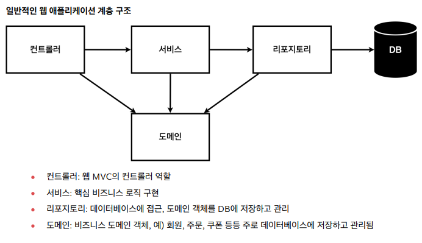
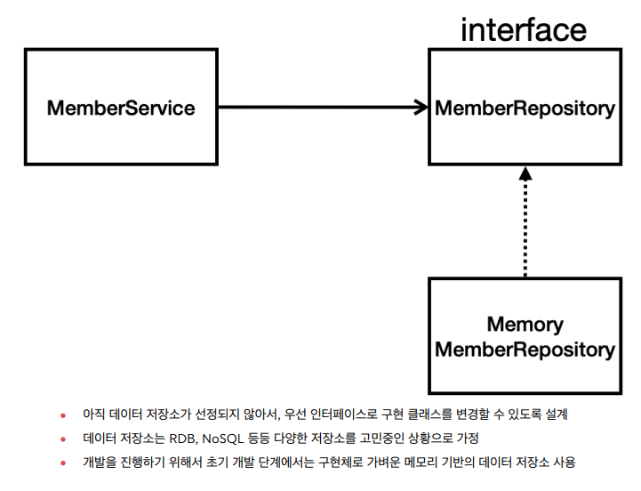

# 스프링 입문 - 코드로 배우는 스프링 부트, 웹 MVC, DB 접근 기술

2023년 3월달에 수강했던 강의이지만, 복습 부족으로 까먹어버렸다.

빠르고 신속하게 재 수강하여 예전의 지식을 다시 떠오르게 한다.


<details>
<summary>정적 컨텐츠, MVC, API</summary>

## 정적 컨텐츠 
server에서 하는 일 없이 파일 자체를 웹 브라우저에 전달한다.

원하는 파일을 __resources/static__ 아래에 넣으면 **정적 컨텐츠**로 인식한다.

* 동작 과정
  1. hello-static Controller가 있는지 검사한다.
  2. 해당 Controller가 없으면 static에서 정적 컨텐츠(hello-static)이 있는지 검사한다.
  3. 해당 html(hello-static.html)을 웹 브라우저에 전달한다.

## MVC와 템플릿 엔진
server에서 html을 변형 후(템플릿 엔진) 전달

사용자가 입력을 담당하는 View를 통해 요청을 보내면, 해당 요청을 Controller가 받고,
Contorller는 Moedl을 통해 데이터를 가져와, 해당 Model이 가진 데이터를 기반으로 출력을 담당하는(사용자에게 보여지는) View에서 제어해 사용자에게 전달한다.

### 1. Model
어플리케이션이 무엇을 할 것인지 정의한다.

내부 비지니스 로직을 처리하기 위한 역할, DB와 연동해 사용자가 입력한 데이터나 출력할 데이터를 다룬다.

### 2. View 
사용자에게 입력 받고 출력될 화면을 보여준다.

### 3. Controller
Model과 VIew 사이에 있는 컴포넌트이다.

Model이 데이터를 어떻게 처리할 지 알려주는 역할, 처리 결과를 가지고 화면을 생성하도록 View에 전달.

* __localhost:8080/hello-mvc를 하면 오류가 나는 이유__
파라미터로 넘어온 값이 없기 때문 ?name=value 를 추가해 파라미터값을 넘겨주자.


## API
정적 컨텐츠, MVC는 html을 웹브라우저에 전달

하지만 __API는 값 자체를 전달__ 한다.

1. __그 값이 문자일 경우__
    * ResponseBody에서 문자를 Http Body태그에 직접 반환
    * 위 역할을 HttpMessageConverter에서 StringConverter가 도와줌
2. __그 값이 객체일 경우__
    * Http의 Body태그에 객체를 JSON 방식으로 변환해 직접 반환
    * 위 역할을 HttpMessageConverter에서 JsonConverter가 수행

</details>


<!--비지니스 요구사항 정리-->
<details>
<summary>비지니스 요구사항 정리</summary>

## 일반적인 웹 어플리케이션 구조

컨트롤러: 웹 MVC의 컨트롤러 역할

서비스: 핵심 비지니스 로직 구현

리포지토리: 데이터베이스에 접근, 도메인 객체를 DB에 저장하고 관리

도메인: 비지니스 도메인 객체, ex)회원, 주문, 쿠폰


##클래스 의존관계



</details>

<details>
<summary>회원 도메인과 리포지토리 만들기</summary>
public class Member {

```java
//Member Domain 만들기
package hello.hellospring.domain;
public class Member {

    private Long id;
    private String name;

    public Long getId() {
        return id;
    }

    public void setId(Long id) {
        this.id = id;
    }

    public String getName() {
        return name;
    }

    public void setName(String name) {
        this.name = name;
    }
}
```

* MemberRepository Interface만들기
* 일단 Map에 멤버를 저장한다.
* 하지만 추후 인메모리 DB (H2) 또는 MySQL을 사용 할 수 있기 때문에 인터페이스를 만들고 바꿔끼우기(코드수정) 쉽게 인터페이스를 만들고 실제 사용하는 Repostiroy가 이를 구현하도록한다.

- MemberRepository는 저장, 조회(id, name, all) 기능을 가지고 있다.
```java
//MemberRepository 
package hello.hellospring.repository;
import hello.hellospring.domain.Member;
import java.util.*;

public interface MemberRepository {
    //리포지토리의 4가지 기능 만들기
    Member save(Member member);

    Optional<Member> findById(Long id);

    Optional<Member> findByName(String name);

    List<Member> findAll();
}

```


Map을 사용하는 MemoryMemberRepository -> MemberRepository의 기능을 구현한다.
```java
package hello.hellospring.repository;
import hello.hellospring.domain.Member;
import java.util.*;

public class MemoryMemberRepository implements MemberRepository{

    private static Map<Long, Member> store = new HashMap<>();
    private static long sequence = 0L; //id 설정

    @Override
    public Member save(Member member) {
        member.setId(++sequence);
        store.put(member.getId(), member);

        return member;
    }

    @Override
    public Optional<Member> findById(Long id) {

        // Null이 있으면 Optional로 감싸서 반환
        return Optional.ofNullable(store.get(id)); 
    }

    @Override
    public Optional<Member> findByName(String name) {
        //람다식 사용으로 반환
        return store.values().stream() 
                .filter(member -> member.getName().equals(name))
                .findAny();
    }

    @Override
    public List<Member> findAll() {

        return new ArrayList<>(store.values());
    }
}


```
</details>

<details>
<summary>회원 리포지토리 테스트 케이스 작성</summary>
전에 작성한 MemoryMemberRepository 메서드가 제대로 작동하는 지를 테스트 케이스를 통해 확인한다.


</details>